# 🎯 AutoTrackSamYOLO
### Universal Object Tracking Pipeline: From Zero-Shot Annotation to YOLO Deployment


**AutoTrackSamYOLO** is a powerful, GUI-based desktop application designed to automate the detection, tracking, and analysis of **any moving object** in video footage. 
<p align="center">
  
</p>
Whether you are tracking **cells in a petri dish, vehicles on a highway, athletes on a field, or animals in the wild**, this tool solves the "Cold Start" problem. It leverages **Meta's Segment Anything Model 3 (SAM 3)** to semi-automatically label and track targets without requiring thousands of manual bounding boxes.

Beyond tracking, it serves as a **Dataset Factory**: automatically converting tracked data into training-ready **YOLO formats**, training custom models locally, and preparing your workflow for high-performance inference systems like **EthoGrid**.

---

## 🔄 The Workflow
Bridge the gap between raw footage and actionable insights.

```mermaid
graph LR
    A[Raw Video Input] --> B(AutoTrackSamYOLO);
    B --> C{Hybrid SAM 3 Tracking};
    C --> D[Export CSV, Heatmaps & Plots];
    C --> E[Auto-Generate YOLO Dataset];
    E --> F[Train Custom YOLO Model];
    F --> G[🚀 Deploy in EthoGrid];
    G --> H[High-Throughput Analysis];

```


## 🌟 Key Features

### 1. Hybrid One-Shot Detection
**Eliminate the tedious task of manual labeling.**

- **Draw Once**: Simply draw a bounding box around one example target (e.g., one car, one cell, one person).
- **Find All**: The engine uses advanced template matching and visual similarity scanning to instantly locate all similar objects in the frame.
- **Track Everywhere**: SAM 3 propagates these masks through time with pixel-perfect precision, handling occlusions and complex movements.

### 2. Hardware-Optimized Performance
**Run state-of-the-art AI models on standard consumer hardware.**

- **Smart Chunking**: Automatically splits long videos into manageable segments (e.g., 5-10s) to prevent memory overflows.
- **VRAM Management**: Processes objects in batches (e.g., 16 targets at a time) to ensure smooth operation on 8GB-12GB GPUs.
- **Fast Mode**: Toggle video rendering off for 50-70% faster data extraction when visual overlays aren't needed.

### 3. Comprehensive Analytics
**Turn video into data immediately.**

- **Quantitative Data**: Exports detailed CSVs with Frame_ID, Object_ID, Centroid_X/Y, Size_Pixels, and Real_World_Size.
- **Visual Insights**: Auto-generates Density Heatmaps, Trajectory Plots, and Size Distribution Histograms for instant reporting.
- **Custom Calibration**: Input your specific scale (e.g., meters/pixel or µm/pixel) for accurate real-world measurements.

### 4. YOLO Dataset & Training Suite
- **Auto-Labeling**: Converts SAM 3 tracking histories into standard YOLO .txt annotations automatically.
- **Smart Split**: User-defined Train/Validation/Test split ratios.
- **Integrated Trainer**: A built-in GUI to fine-tune YOLOv8/v11 models on your newly created dataset—no coding required.

## 🔗 Integration with EthoGrid

AutoTrackSamYOLO is the official training companion for EthoGrid.

- While SAM 3 is incredible for initial annotation and zero-shot tracking, it is computationally heavy for real-time applications. For analyzing hours of footage efficiently, a lightweight detector like YOLO is preferred.
- Use AutoTrackSamYOLO to label a small subset of your videos and train a custom YOLO model.
- Load your trained .pt model into EthoGrid.
- Perform in-depth, real-time behavioral analysis (velocity profiling, zone preference, interaction metrics, turning angles) on massive datasets with high efficiency.

## 🛠️ Installation

### Prerequisites
- Python 3.10 or higher
- NVIDIA GPU (CUDA) recommended for SAM 3 & Training.

### Setup

1. **Clone the Repository:**
```bash
git clone https://github.com/yourusername/AutoTrackSamYOLO.git
cd AutoTrackSamYOLO
```
2. **Install Dependencies:**
```bash
pip install -r requirements.txt
or
conda env create -f environment.yml
```
3. **Link SAM 3:**
Download the SAM 3 / SAM 2 repository and checkpoints. You will point the app to this folder in the GUI configuration.
4. **Run the App:**
```bash
python main.py
```


## 📖 User Guide

### Step 1: Tracking & Analysis
1.  **Input:** Click **"Add File"** or **"Add Folder"** to load your videos.
2.  **Configure:** Set your **Pixel Scale** (e.g., 0.5 meters/pixel) and **Match Sensitivity** (0.60 is standard).
3.  **Template:** Click a video. Draw boxes around **representative targets** (e.g., "Vehicle Type A", "Subject B"). Click **Preview** to verify detection.
4.  **Run:** Click **Start Batch Analysis**.
5.  **Output:** The app generates a results folder containing the tracked video, CSV physics data, and visual plots.

### Step 2: Create YOLO Dataset
1.  Open the **Dataset Creator** from the launcher.
2.  Select your **Raw Videos** folder and the **SAM3 Results** folder (generated in Step 1).
3.  Define **Max Frames** to sample and your **Train/Val/Test** split percentages.
4.  Click **Generate**. The app extracts frames, normalizes bounding boxes, and organizes the folder structure for YOLO.

### Step 3: Train Model
1.  Open the **Model Trainer**.
2.  Select the `data.yaml` file generated in Step 2.
3.  Choose a base model (e.g., `yolov8n.pt` for speed, `yolov8x.pt` for accuracy).
4.  Click **Start Training**. You can monitor loss and mAP metrics directly in the GUI log.

---

## 📂 Output Structure

For every video processed, a structured folder is created:

```text
SAM3_Results/
└── Run_YYYY-MM-DD_HH-MM/
    └── Video_Name/
        ├── Video_Name_tracked.mp4      # Visual overlay
        ├── Video_Name_data.csv         # Position & Size data
        ├── Video_Name_heatmap.png      # Movement density
        ├── Video_Name_traj.png         # Path/Trajectory plot
        └── Video_Name_hist.png         # Object size distribution
```
## 🤝 Contributing
We welcome contributions! Whether it's support for new model architectures, UI improvements, or additional analytics features, please feel free to submit a Pull Request.

## 📜 Citation
If you use **AutoTrackSamYOLO** in your work, please cite:

> [Your Name/Organization]. (2025). AutoTrackSamYOLO: Universal Object Tracking and Dataset Generation Pipeline. GitHub Repository.

---

*Democratizing AI-powered computer vision for researchers, engineers, and analysts.*